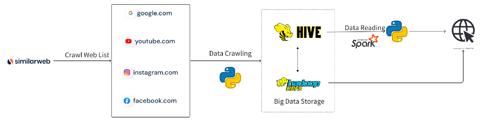
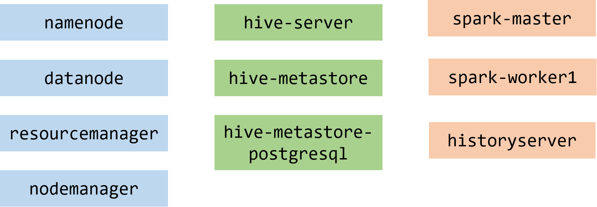

# BigData-Experiment

## 小组基本信息

项目名称：基于大数据的相似网页推荐系统

小组成员：霍嘉、褚旭、张桐恩、李玥、李津舟、朱江

## 任务进度汇报

目前已经初步实现基于`Hadoop + Hive + Spark`的大数据基础集群架构，目前采用的处理逻辑是将爬取到的网页原始数据（包括网页源代码、网页截图）存储到 HDFS 中，然后在需要进行任务相似度分析的时候将待处理文件传入到 HDFS 上，编写 Spark 程序读取待处理文件及其他数据集，使用 MapReduce 对所有的数据进行相似度分析，将得到的结果存储 Hive 数据库中，然后在后端业务代码中对处理得到的结果进行检索，得到相似度最高的网页返回到前端页面展示中

### 系统整体架构



### 集群节点



### 关键代码

项目代码仓库：[Github](https://github.com/Hydrion-Qlz/BigData-Experiment)

#### 网页相似度分析代码

```python
from bs4 import BeautifulSoup
import os

code = None


def scan_label_set(html_doc, label_set):
    soup = BeautifulSoup(html_doc, 'html.parser')
    label_set.add(soup.name)
    for child in soup.descendants:
        try:
            if child.name == None:
                if child.replace("\n", '').replace(" ", '') == "":
                    label_set.add("empty")
                else:
                    label_set.add("str")
            else:
                label_set.add(child.name)
        except:
            pass


def scan_label_set_and_encode(html_doc1, html_doc2):
    label_set = set()

    scan_label_set(html_doc1, label_set)
    scan_label_set(html_doc2, label_set)

    encode_dict = {}
    i = 0
    print(list(label_set))
    for key in sorted(list(label_set)):
        print(key)
        encode_dict[key] = str(i).zfill(3)
        i += 1
    return encode_dict


def levenshtein_distance(hash1, hash2):
    if not hash1:
        return len(hash2 or '') or 0
    if not hash2:
        return len(hash1 or '') or 0

    size1 = len(hash1)
    size2 = len(hash2)

    last = 0
    tmp = list(range(size2 + 1))
    value = None

    for i in range(size1):
        tmp[0] = i + 1
        last = i

        for j in range(size2):
            if hash1[i] == hash2[j]:
                value = last
            else:
                value = 1 + min(last, tmp[j], tmp[j + 1])

            last = tmp[j + 1]
            tmp[j + 1] = value

    return value


def levenshtein_similarity(hash1, hash2):
    hash1 = hash1.split('/')
    hash2 = hash2.split('/')

    distance = levenshtein_distance(hash1, hash2)

    return distance / max(len(hash1), len(hash2))


def compare_nodes(node1, node2):
    try:
        return node1.hash == node2.hash
    except Exception as e:
        pass
    return False


def tree_hash_and_merge(root):
    try:
        root.hash = code[root.name]
    except:
        root.hash = "999"

    for child in root.children:
        try:
            tree_hash_and_merge(child)
        except:
            pass

    counter1 = 0
    for child1 in root.children:
        counter1 += 1
        counter2 = 0
        for child2 in root.children:
            counter2 += 1
            if counter2 <= counter1:
                continue
            if compare_nodes(child1, child2) and len(child1.hash) > 3:
                child2.decompose()

    for child in root.children:
        try:
            root.hash = root.hash + "/" + child.hash
        except Exception as e:
            pass


def get_soup_hash(doc):
    soup = BeautifulSoup(doc, "html.parser")
    tree_hash_and_merge(soup)
    return soup.hash


def structure_comp(html_doc1, html_doc2):
    global code
    code = scan_label_set_and_encode(html_doc1, html_doc2)
    hash1 = get_soup_hash(html_doc1)
    print("hash1", hash1)
    hash2 = get_soup_hash(html_doc2)
    print("hash2", hash2)
    differ_value = levenshtein_similarity(hash1, hash2)
    return differ_value
```

#### spark 处理代码

```python
spark = SparkSession.builder \
        .appName("SimilarityMatching") \
        .enableHiveSupport() \
        .getOrCreate()

    namenode = 'hdfs://namenode:9000'
    webpages_path = namenode + "/data/bigdata/webpages/"
    inputFilePath = namenode + "/data/bigdata/input/0010.htm"

    inputFileContent = spark.read.text(inputFilePath).rdd.map(lambda row: row[0]).collect()

    file_contents_rdd = spark.sparkContext.wholeTextFiles(webpages_path)

    # calc similarity
    similarity_results_rdd = file_contents_rdd.map(lambda x: structure_comp(x[0], x[1]))

    # collect result
    similarity_results = similarity_results_rdd.collect()

    for file_path, similarity in similarity_results:
        print("File Path:", file_path)

    similarity_df = spark.createDataFrame(similarity_results, ["File-Path", "Similarity"])

    databaseName = "bigdata"
    existingDatabases = spark.catalog.listDatabases()
    if databaseName not in [db.name for db in existingDatabases]:
        spark.sql("CREATE DATABASE "+ databaseName)
        print("Database " + databaseName +" created.")

    outputTableName = "bigdata.similarity"
    similarity_df.write.mode("overwrite").saveAsTable(outputTableName)

    databases = spark.catalog.listDatabases()
    print(databases)
    tables = spark.catalog.listTables(databaseName)
    print(tables)
    result = spark.sql("SELECT * FROM " + outputTableName)
    result.show()
```

### 实现页面


